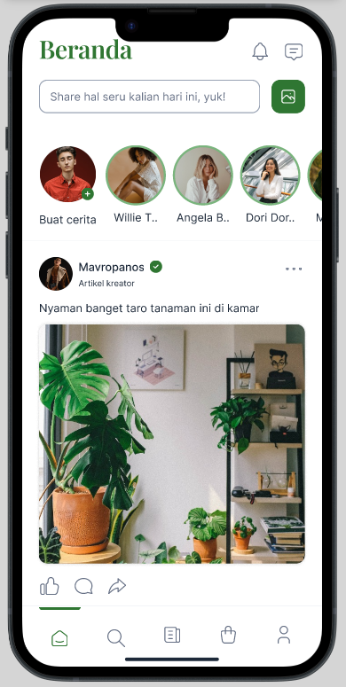
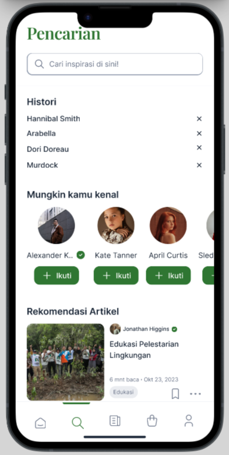
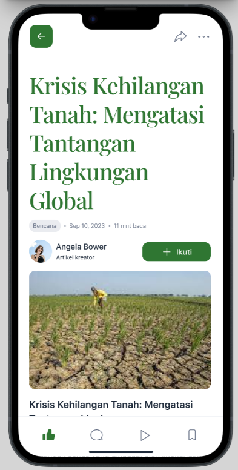
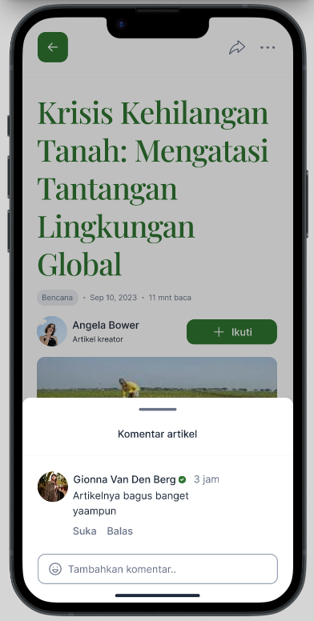
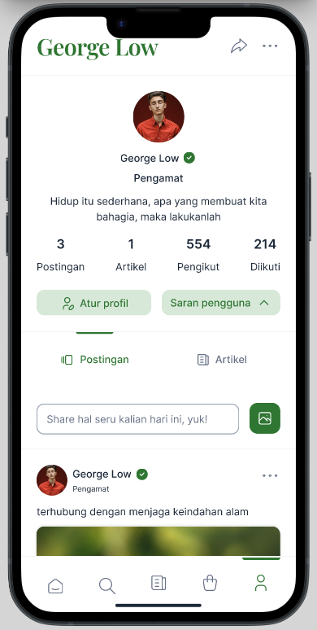

# Aksi Seru APP

The exciting action app is an open source application with the main theme being social media specifically for the environment. This application is written with flutter & dart as the main programming language and communicates with the server via REST on the main server. 
**This application is still being developed** to fulfill one of my course projects.

 

